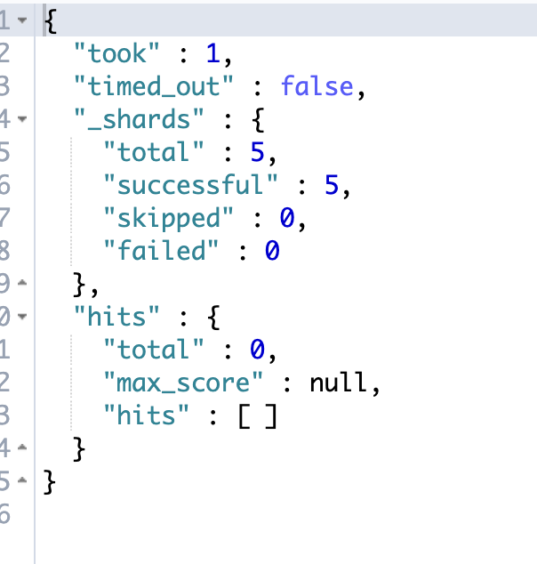
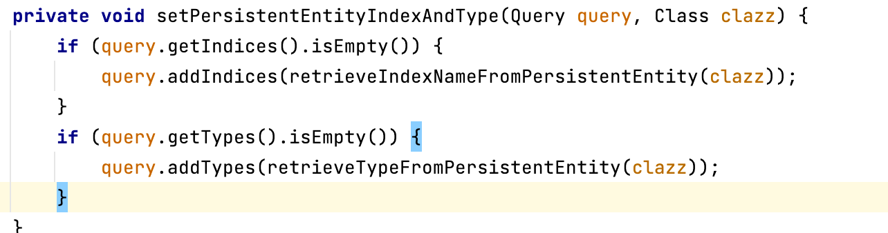

# Elasticsearch查询demo

### 前言

es的查询相比于mysql的更加的复杂，还有聚合这种复杂的用法，故在经过一段时间的代码学习之后，进行一下es查询方式的实战
### 准备：项目版本确定
这是项目中的版本
springboot 2.2.5
spring-boot-starter-elasticsearch 2.2.5
spring-data-elasticsearch 3.2.5
es版本 6.8.6

### 准备：索引的创建

以book作为示例，创建索引的语句如下：

```
{
     "settings": {
        "number_of_replicas": 1,  //分片副本数量
        "number_of_shards": 2 //分片数量
      },
      "mappings": { //字段类型映射
        "properties": {
          "title":{ //书的标题
            "type": "text",
            "fields": { //多字段类型映射，代表字段可能有多种类型，用于不同的目的，比如排序、聚合时，text类型不能使用，这时就可以用title.keyword指定为keyword类型
              "keyword":{
                "type":"keyword"
              }
            }
          },
          "timestamp":{ // 购买时间
            "type": "date",
            "format": "epoch_millis" //格式为ms
          },
          "price":{ //价格
            "type": "double"
          },
          "description":{ //描述
            "type": "text"
          },
          "tags":{ // 标签，数组类型，es没有特殊的数组类型，而是一个字段可以存入很多值，但是必须同一个类型
            "type": "integer"
          },
          "rank":{ // 评价星级
            "type": "integer"
          },
          "people":{ //购买人name
            "type": "keyword"
          },
          "author":{ // 作者信息 对象
            "properties": {
              "id":{
                "type":"integer"
              },
              "name":{
                "type":"text",
                "fields":{
                  "keyword":{
                    "type":"keyword"
                  }
                }
              }
            }
          }
        }
      }
}
```

### 准备：项目创建

```
        <dependency>
            <groupId>org.springframework.boot</groupId>
            <artifactId>spring-boot-starter-data-elasticsearch</artifactId>
            <version>2.7.14</version>
        </dependency>
```


https://spring.io/projects/spring-data-elasticsearch

- ElasticsearchRepository可以做[Elasticsearch](https://so.csdn.net/so/search?q=Elasticsearch&spm=1001.2101.3001.7020)的相关数据的增删改查，用法类似jpa的接口，这样就能统一ElasticSearch和普通的JPA操作，获得和操作mysql一样的代码体验,但是功能比较简单，复杂查询与操作就不好搞了。
- ElasticsearchTemplate 则提供了更多的方法，稍微更加底层一点，功能更加强大。
- RestHighLevelClient 更加底层的api客户端 8.x版本中，官方推荐使用ElasticsearchClient(8.x)

> 在新版的spring-data-elasticsearch中，`ElasticsearchRestTemplate`代替了原来的`ElasticsearchTemplate`。原因是`ElasticsearchTemplate`基于`TransportClient`，`TransportClient`即将在8.x以后的版本中移除。`ElasticsearchRestTemplate`基于`RestHighLevelClient`，如果不手动配置`RestHighLevelClient`bean，`ElasticsearchRestTemplate`将使用`org.springframework.boot.autoconfigure.elasticsearch.rest.RestClientConfigurations`默认配置的`RestHighLevelClient`

```java
//注入ElasticsearchTemplate 这里使用的是es官方提供的es java api client
// 文档 https://www.elastic.co/guide/en/elasticsearch/client/java-api-client/current/introduction.html
// HLRC已经被弃用了
//The HLRC version 7.17 can be used with Elasticsearch version 8.x by enabling HLRC’s compatibility mode (see code sample below). In this mode HLRC sends additional headers that instruct Elasticsearch 8.x to behave like a 7.x server.
@Configuration
public class ElasticConfig {
    @Bean
    public ElasticsearchClient client(){
        RestClient httpClient = RestClient.builder(
                new HttpHost("localhost", 9200)
        ).build(); 
        ElasticsearchTransport transport = new RestClientTransport(httpClient,new JacksonJsonpMapper());
        return new ElasticsearchClient(transport);
    }
    @Bean
    public ElasticsearchTemplate elasticsearchTemplate(ElasticsearchClient client, ElasticsearchConverter converter) {
        try {
            return new ElasticsearchTemplate(client, converter);
        }
        catch (Exception ex) {
            throw new IllegalStateException(ex);
        }
    }
}
```

```java
//项目中关于ehl的配置
//elasticsearchTemplate是自动装配的，但是我用的这个版本不行
```


[Elasticsearch Index Lifecycle Management - 简书](https://www.jianshu.com/p/8334a5ae5de5)

[Index lifecycle | Elasticsearch Guide [8.9] | Elastic](https://www.elastic.co/guide/en/elasticsearch/reference/current/ilm-index-lifecycle.html#ilm-index-lifecycle)

[初探 Elasticsearch Index Template（索引模板) - 简书](https://www.jianshu.com/p/1f67e4436c37)

### 准备：数据的写入

编写映射实体对象 这个id 好像不是es的id，没法映射上去

```java
@Data
@Accessors(chain = true)
@Document(indexName = "book_record",createIndex = false,type = "_doc")
public class BookRecord {

    @Id
    private String id;

    @MultiField(mainField = @Field(type = FieldType.Text),otherFields = @InnerField(suffix = "keyword",type = FieldType.Keyword))
    private String title;

    @Field(type = FieldType.Keyword)
    private String people;

    @Field(type = FieldType.Double)
    private Double price;

    @Field(type = FieldType.Integer)
    private List<Integer> tags;

    @Field(type = FieldType.Integer)
    private Integer rank;

    @Field(type = FieldType.Date)
    private Long timestamp;

    @Field(type = FieldType.Object)
    private Author author;

    @Field(type = FieldType.Text)
    private String description;

}

@Data
@Accessors(chain = true)
public class Author {

    @Field(type = FieldType.Integer)
    private Integer id;

    @MultiField(mainField = @Field(type = FieldType.Text),otherFields = @InnerField(suffix = "keyword",type = FieldType.Keyword))
    private String name;

}
```


准备测试数据，大量数据的写入，需要使用bulk批量进行index,量小时可以使用index方法

```java
public void insertData(){
    BookRecord bookRecord = new BookRecord().setRank(0).setPrice(32.0).setTimestamp(System.currentTimeMillis()).setDescription("123")
            .setTags(Arrays.asList(1,2)).setAuthor(new Author().setId(1).setName("1234")).setPeople("1211").setTitle("test");
    //IndexQuery
    IndexQuery build = new IndexQueryBuilder().withIndexName(INDEX_NAME).withObject(bookRecord).build();
    System.out.println(elasticsearchTemplate.index(build));
}
```


```java
//写入10000条数据
@Service
public class ElasticService {

    public static final String INDEX_NAME = "book_record";

    @Autowired
    private ElasticsearchTemplate elasticsearchTemplate;

    public void insertBatch(){
        Random random = new Random();

        List<IndexQuery> queries = new ArrayList<>();
        List<Integer> tags = Arrays.asList(1,2,3,4,5);

        for (int i = 0; i < 10000; i++) {

            List<Integer> parts = new ArrayList<>();
            int one = random.nextInt(3);
            parts.add(tags.get(one));
            int two = random.nextInt(3)+2;
            if (one != two){
                parts.add(tags.get(two));
            }

            Author author = new Author().setId((i % 3) + 1).setName("author_" + ((i % 3) + 1));
            BookRecord bookRecord = new BookRecord().setRank((i % 4) + 1)
                    .setTitle("book_" + (i % 4) + "_" + i)
                    .setAuthor(author)
                    .setPrice((double) (30 + random.nextInt(30)))
                    .setTimestamp(System.currentTimeMillis())
                    .setTags(parts)
                    .setPeople("reader"+((i+1)%100+1));
            IndexQueryBuilder indexQueryBuilder = new IndexQueryBuilder().withObject(bookRecord).withIndex(INDEX_NAME);
            queries.add(indexQueryBuilder.build());
            if (i%500 == 0){
                List<IndexedObjectInformation> indexedObjectInformations = elasticsearchTemplate.bulkIndex(queries, IndexCoordinates.of(INDEX_NAME));
                queries.clear();
            }
        }
        if (queries.size()!=0){
            elasticsearchTemplate.bulkIndex(queries,IndexCoordinates.of(INDEX_NAME));
            queries.clear();
        }

    }

}
```


### 数据的更新

数据的更新可以使用update/bulkUpdate方法进行操作

```java
@Service
public class ElasticsearchUpdateTest {

    @Autowired
    private ElasticsearchTemplate elasticsearchTemplate;

    public static final String INDEX_NAME = "book_record";

    public void updateData(){
//        BookRecord bookRecord = new BookRecord().setId("RgKCNooBC4jnidQ98vIC").setRank(100);

      //需要一个map对象将更新的参数进行存储
        HashMap<String, Object> parms = new HashMap<>();
        parms.put("id","RgKCNooBC4jnidQ98vIC");
        parms.put("rank",100);


        UpdateRequest updateRequest = new UpdateRequest();
        //设置为更新后立即对搜索可见
        updateRequest.setRefreshPolicy(WriteRequest.RefreshPolicy.IMMEDIATE);
      
        updateRequest.doc(parms);

        UpdateQuery build1 = new UpdateQueryBuilder().withId("RgKCNooBC4jnidQ98vIC").withClass(BookRecord.class)
                .withUpdateRequest(updateRequest).build();

        //是部分更新，只会更新有值的字段
        UpdateResponse update = elasticsearchTemplate.update(build1);

        System.out.println(update);


    }
}
```

注意这里的updateRequest.doc有一个重载方法是Object... 这个其实是key,value的形式的，并不是可以直接放进去一个对象

我觉得这个api不是很好用，首先不能传入一个对象，其次貌似无法指定query,筛选需要更新的数据，项目里的写法好像是用的rhlc，有一个用script的方法(updateQuery里有一个updateRequest对象，应该能做到)


### 数据的删除

这个还是比较方便的，既能够id删除，也能够条件删除

```java
@Service
public class ElasticsearchDeleteTest {

    @Autowired
    private ElasticsearchTemplate elasticsearchTemplate;

    public static final String INDEX_NAME = "book_record";

    public void deleteData(){

        DeleteQuery deleteQuery = new DeleteQuery();

        deleteQuery.setQuery(ElasticsearchUtil.ge("rank",90));

        deleteQuery.setIndex(INDEX_NAME);

        elasticsearchTemplate.delete(deleteQuery, BookRecord.class);

        System.out.println();


    }

    public void deleteDataById(){
        elasticsearchTemplate.delete(BookRecord.class,"RwKENooBC4jnidQ9ePLz");
    }
}
```




### 数据的查询

elasticsearchTemplate提供了如下查询doc的api

- elasticsearchTemplate.queryForIds();
- elasticsearchTemplate.queryForList();
- elasticsearchTemplate.query();
- elasticsearchTemplate.queryForPage();
- 也提供了multiSearch的api，传入List\<Query\>

#### 查询条件的构建 NativeSearchQueryBuilder->NativeSearchQuery

通过这个QueryBuilder，可以构建出查询条件、分页、排序等。

通过布尔查询的嵌套可以构建出多个查询条件的组合。（must must_not should filter）

```java
    private NativeSearchQueryBuilder buildQuery() {
        NativeSearchQueryBuilder nativeSearchQueryBuilder = new NativeSearchQueryBuilder();

        BoolQueryBuilder boolQueryBuilder = new BoolQueryBuilder();
        boolQueryBuilder.must(ElasticsearchUtil.in("tag",getTagList(1,3)));
        boolQueryBuilder.mustNot(ElasticsearchUtil.ge("price",40));
        boolQueryBuilder.should(ElasticsearchUtil.match("",""))
                .should(QueryBuilders.matchAllQuery())
                .minimumShouldMatch(1);

        nativeSearchQueryBuilder.withQuery(boolQueryBuilder);
        nativeSearchQueryBuilder.withSort(SortBuilders.fieldSort("timestamp").order(SortOrder.DESC));
        nativeSearchQueryBuilder.withPageable(PageRequest.of(1,2));
        return nativeSearchQueryBuilder;
        
    }
```

- queryForPage

分页获得查询的doc，按照设置的withPageable

class对象指定返回结果的类型，如果query中没有包含索引的信息，也会从clazz的注解中去获取



```
AggregatedPage<BookRecord> bookRecords = elasticsearchTemplate.queryForPage(build, BookRecord.class);
List<BookRecord> content = bookRecords.getContent(); //获取查询到的文档
```

- queryForPage-extract

对返回的分页结果进行包装

- queryForList

直接获取结果列表

```
List<BookRecord> bookRecords = elasticsearchTemplate.queryForList(build, BookRecord.class);
```

- queryForIds

只返回id

```
System.out.println(elasticsearchTemplate.queryForIds(build));
```

- query

只返回一个结果，结果的类型由ResultsExtractor对象决定,负责将返回的response转换成对应的对象

```
elasticsearchTemplate.query(query, new ResultsExtractor<BookRecord>() {
    @Override
    public BookRecord extract(SearchResponse response) {
        SearchHits hits = response.getHits();
        System.out.println(hits.totalHits);
        SearchHit[] hits1 = hits.getHits();
        if (hits1 != null || hits1.length>0){
            SearchHit a = hits1[0];
            // source各个字段的key value
            Map<String, Object> sourceAsMap = a.getSourceAsMap();
            System.out.println(a.getSourceAsMap());
        }
        return null;
    }
});
```

