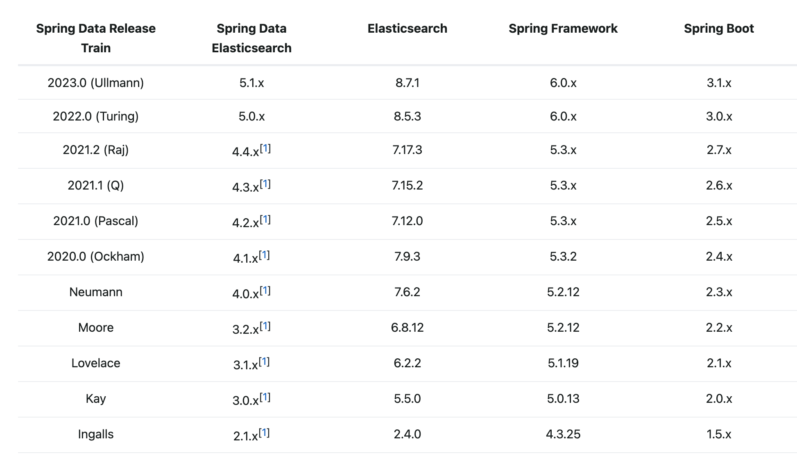
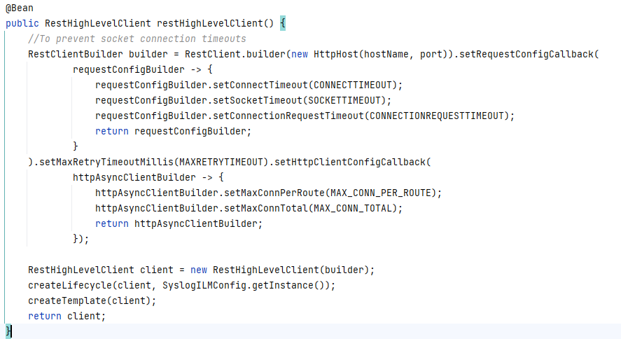
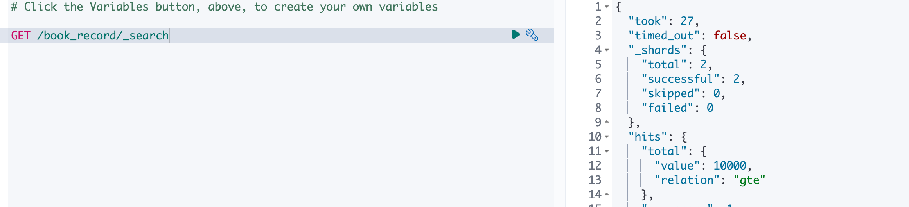

# Elasticsearch查询demo

### 前言

es的查询相比于mysql的更加的复杂，还有聚合这种复杂的用法，故在经过一段时间的代码学习之后，进行一下es查询方式的实战
### 准备：项目版本确定
这是项目中的版本
springboot 2.2.5
spring-boot-starter-elasticsearch 2.2.5
spring-data-elasticsearch 3.2.5
es版本 6.8.6

### 准备：索引的创建

以book作为示例，创建索引的语句如下：

```
{
     "settings": {
        "number_of_replicas": 1,  //分片副本数量
        "number_of_shards": 2 //分片数量
      },
      "mappings": { //字段类型映射
        "properties": {
          "title":{ //书的标题
            "type": "text",
            "fields": { //多字段类型映射，代表字段可能有多种类型，用于不同的目的，比如排序、聚合时，text类型不能使用，这时就可以用title.keyword指定为keyword类型
              "keyword":{
                "type":"keyword"
              }
            }
          },
          "timestamp":{ // 购买时间
            "type": "date",
            "format": "epoch_millis" //格式为ms
          },
          "price":{ //价格
            "type": "double"
          },
          "description":{ //描述
            "type": "text"
          },
          "tags":{ // 标签，数组类型，es没有特殊的数组类型，而是一个字段可以存入很多值，但是必须同一个类型
            "type": "integer"
          },
          "rank":{ // 评价星级
            "type": "integer"
          },
          "people":{ //购买人name
            "type": "keyword"
          },
          "author":{ // 作者信息 对象
            "properties": {
              "id":{
                "type":"integer"
              },
              "name":{
                "type":"text",
                "fields":{
                  "keyword":{
                    "type":"keyword"
                  }
                }
              }
            }
          }
        }
      }
}
```

### 准备：项目创建

```
        <dependency>
            <groupId>org.springframework.boot</groupId>
            <artifactId>spring-boot-starter-data-elasticsearch</artifactId>
            <version>2.7.14</version>
        </dependency>
```



https://spring.io/projects/spring-data-elasticsearch

- ElasticsearchRepository可以做[Elasticsearch](https://so.csdn.net/so/search?q=Elasticsearch&spm=1001.2101.3001.7020)的相关数据的增删改查，用法和普通的接口是一样的，这样就能统一ElasticSearch和普通的JPA操作，获得和操作mysql一样的代码体验,但是功能比较简单，复杂查询与操作就不好搞了。
- ElasticsearchTemplate 则提供了更多的方法，稍微更加底层一点，功能更加强大。
- RestHighLevelClient 更加底层的api客户端 已过时，官方推荐使用ElasticsearchClient(8.x)

```java
//注入ElasticsearchTemplate 这里使用的是es官方提供的es java api client
// 文档 https://www.elastic.co/guide/en/elasticsearch/client/java-api-client/current/introduction.html
// HLRC已经被弃用了
//The HLRC version 7.17 can be used with Elasticsearch version 8.x by enabling HLRC’s compatibility mode (see code sample below). In this mode HLRC sends additional headers that instruct Elasticsearch 8.x to behave like a 7.x server.
@Configuration
public class ElasticConfig {
    @Bean
    public ElasticsearchClient client(){
        RestClient httpClient = RestClient.builder(
                new HttpHost("localhost", 9200)
        ).build(); 
        ElasticsearchTransport transport = new RestClientTransport(httpClient,new JacksonJsonpMapper());
        return new ElasticsearchClient(transport);
    }
    @Bean
    public ElasticsearchTemplate elasticsearchTemplate(ElasticsearchClient client, ElasticsearchConverter converter) {
        try {
            return new ElasticsearchTemplate(client, converter);
        }
        catch (Exception ex) {
            throw new IllegalStateException(ex);
        }
    }
}
```

```java
//项目中关于ehl的配置
//elasticsearchTemplate是自动装配的，但是我用的这个版本不行
```



[Elasticsearch Index Lifecycle Management - 简书](https://www.jianshu.com/p/8334a5ae5de5)

[Index lifecycle | Elasticsearch Guide [8.9] | Elastic](https://www.elastic.co/guide/en/elasticsearch/reference/current/ilm-index-lifecycle.html#ilm-index-lifecycle)

[初探 Elasticsearch Index Template（索引模板) - 简书](https://www.jianshu.com/p/1f67e4436c37)

### 准备：数据的写入

准备测试数据，大量数据的写入，需要使用bulk批量进行index,量小时可以使用index方法

```java
//写入10000条数据
@Service
public class ElasticService {

    public static final String INDEX_NAME = "book_record";

    @Autowired
    private ElasticsearchTemplate elasticsearchTemplate;

    public void insertBatch(){
        Random random = new Random();

        List<IndexQuery> queries = new ArrayList<>();
        List<Integer> tags = Arrays.asList(1,2,3,4,5);

        for (int i = 0; i < 10000; i++) {

            List<Integer> parts = new ArrayList<>();
            int one = random.nextInt(3);
            parts.add(tags.get(one));
            int two = random.nextInt(3)+2;
            if (one != two){
                parts.add(tags.get(two));
            }

            Author author = new Author().setId((i % 3) + 1).setName("author_" + ((i % 3) + 1));
            BookRecord bookRecord = new BookRecord().setRank((i % 4) + 1)
                    .setTitle("book_" + (i % 4) + "_" + i)
                    .setAuthor(author)
                    .setPrice((double) (30 + random.nextInt(30)))
                    .setTimestamp(System.currentTimeMillis())
                    .setTags(parts)
                    .setPeople("reader"+((i+1)%100+1));
            IndexQueryBuilder indexQueryBuilder = new IndexQueryBuilder().withObject(bookRecord).withIndex(INDEX_NAME);
            queries.add(indexQueryBuilder.build());
            if (i%500 == 0){
                List<IndexedObjectInformation> indexedObjectInformations = elasticsearchTemplate.bulkIndex(queries, IndexCoordinates.of(INDEX_NAME));
                queries.clear();
            }
        }
        if (queries.size()!=0){
            elasticsearchTemplate.bulkIndex(queries,IndexCoordinates.of(INDEX_NAME));
            queries.clear();
        }

    }

}
```


