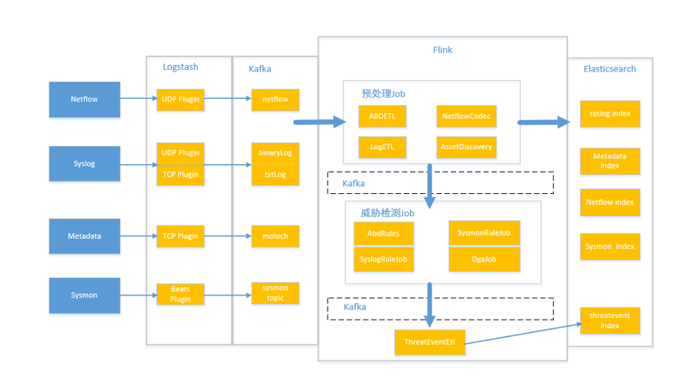
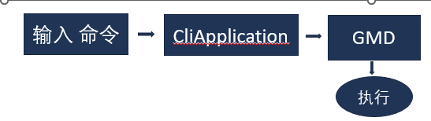
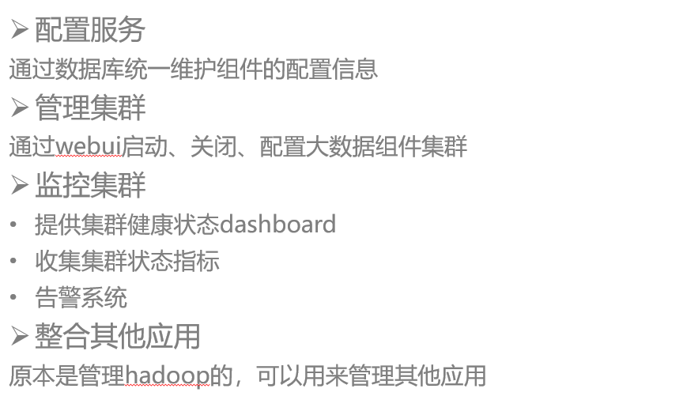

# 智源后台架构

### 智源定位

- **安全信息、安全事件管理平台** 对设备安全信息（日志、告警）进行统一实时监控、历史分析

- **安全运营平台** 以资产为核心，以安全事件管理为关键流程

- **态势感知系统** 威胁情报关联、态势预测等功能

### 核心功能

- 采集、管理企业中it设备产生的安全日志、事件

- 对安全日志、事件实时监控、统计分析

- 基于规则进行威胁检测，关联分析

- 事件响应（手动、自动）

### 数据处理总体流程

1. 其他设备将数据（日志、事件）上传到智源

2. 智源收到数据根据类型写到kafka

3. Flink 作业对kafka数据做预处理
   
   1. 消费kafka数据
   
   2. 数据校验
   
   3. 补充字段
   
   4. 写回kafka（预处理后的topic）
   
   5. 写到Elasticsearch

4. Flink作业基于预处理之后的数据做威胁检测
   
   1. 消费kafka中预处理之后的数据
   
   2. 根据规则检测威胁
   
   3. 生成原始威胁事件，写入kafka

5. ThreatEventETL消费原始威胁事件 添加资产、地理信息等字段 写入ElasticSearch

### 后台进程与组件

#### 容器管理系统-kubenetes

- 管理容器

- 自动部署

##### 智源部署在k8s上的应用

1. api-gateway - 转发前台http请求

2. Logstash – 数据采集

3. Kibana  - elasticsearch数据可视化

4. Webservice - 智源后台主要业务处理进程

5. 关联分析引擎

#### 后端服务

##### 网关 API Gateway (nginx)

转发请求到后端webservice

##### WebServices

- 处理前台请求 - 态势监控、威胁分析、资产管理、风险管理、事件响应…

- 提交Flink作业 - 威胁检测、数据预处理任务

- 定时任务 - 综合评分、失陷评估…

- 对接其他设备 - 探针、云景、防火墙…

- 转发部分请求到GMD - 系统管理相关请求

#### Cli(命令行)

包含系统设置相关的命令，当使用ssh通过hillstone用户登录智源时，进入cli

#### GMD通用管理

处理系统管理相关任务

- 系统信息查询
  
  版本、网络设置、cpu、磁盘使用率…

- 集群配置
  
  添加节点、替换节点、ha配置…

- 网络配置
  
  ip，dns，iptables 规则…

- 系统升级

###### 调用链路

- 处理Cli请求

  Cli命令 -> CliApplication -> GMD

- 处理WebService请求

  UI ->APIGateway -> webservice -> GMD

#### 数据采集-logstash

#### 数据总线-kafka

在智源的数据总线，大部分数据都经过kafka

#### 数据处理引擎-Flink

分布式数据处理框架

###### 应用

- 数据预处理(9个job)
  
  数据校验、归一化、字段丰富、数据入库

- 威胁检测(9个job)
  
  根据规则检测威胁事件

###### WebService中JobMonitor 模块

管理智源所有Flink Job

- 提交Job

- 管理Job配置信息

- 监控Job运行状态

- 记录错误信息

- 重启Job

#### zookeeper 分布式组件协调

###### 使用场景

- 维护组件内部的元数据

  例如Kafka、Flink、Hadoop等都依赖Zookeeper

- 提供分布式同步服务

      分布式锁

- 节点选举

      例如Flink Master HA

- 服务发现

###### 智源应用

- 存储Flink，kafka元数据

- 存储地理库元数据

#### ElasticSearch

- 数据存储
  
  流量、日志、威胁等

- 搜索
  
  流量、日志、威胁相关查询、搜索

- 统计分析
  
  流量、日志、威胁相关统计指标（威胁总数、威胁top5等）

#### redis

- 缓存资产信息，提升资产查询性能

#### 分布式文件系统-HDFS

- 日志导出，地理库文件存储，弱点扫描报告存储

#### Mariadb（mysql）

- 存储资产配置信息、威胁检测规则、威胁情报、地理库等

#### ambari

 
